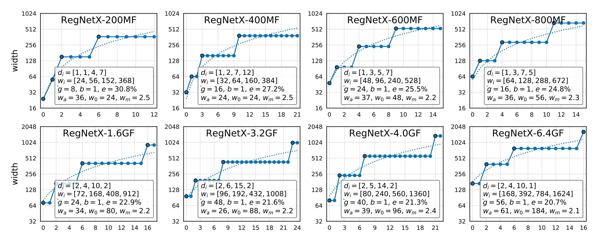

# RegNet-Pytorch

[Designing Network Design Spaces](https://arxiv.org/pdf/2003.13678.pdf) 



### Prerequisite 

Pytorch 1.1.0+

[thop](https://github.com/Lyken17/pytorch-OpCounter) to calculate the flops and params

### CIFAR10

```bash
cd $PATH-TO-THIS-REPO/CIFAR10
```

For CIFAR10 models, the stride for the first stage is set to 1, so that the input size for the last stage won't become to small (2x2). The STEM part does not contain max pooling layer. 

Run the following command to train a regnet from scratch, (add `-e` to evaluate the pre-trained model) 

```bas
python main.py -a regnet_200m 
```

Here is the summary for the accuracy, params and macs. 

| Models      | FLOPs (10^6) | Params (10^6) | Hyper-params                        | Accuracy |
| ----------- | ------------ | ------------- | ----------------------------------- | -------- |
| RegNet-200M | 62           | 2.31          | batch128_wd0.0001_cos300epoch_lr0.1 | 93.58    |
| RegNet-400M | 126          | 4.77          | batch128_wd0.0001_cos300epoch_lr0.1 | 94.15    |
| RegNet-600M | 192          | 5.67          | batch128_wd0.0001_cos300epoch_lr0.1 | 94.73    |
| RegNet-800M | 258          | 6.60          | batch128_wd0.0001_cos300epoch_lr0.1 | 95.01    |
| RegNet-1.6G | 522          | 8.28          | batch128_wd0.0001_cos300epoch_lr0.1 | 95.45    |
| RegNet-3.2G | 1038         | 14.3          | batch128_wd0.0001_cos300epoch_lr0.1 | 95.53    |
| RegNet-4G   | 1298         | 20.8          | batch128_wd0.0001_cos300epoch_lr0.1 | 95.69    |
| RegNet-6.4G | 2108         | 24.6          | batch128_wd0.0001_cos300epoch_lr0.1 | 96.20    |

### ImageNet

For imagenet models, we keep the model and training configuration exactly the same with the original [released codes](https://github.com/facebookresearch/pycls). We train the model using pytorch framework,  and the summary of the results is shown below.

| Models      | FLOPs (10^6) | Params (10^6) | Hyper-params                         | Accuracy (Paper) | Accuracy (Ours) |
| ----------- | ------------ | ------------- | ------------------------------------ | ---------------- | --------------- |
| RegNet-200M | 208          | 2.68          | batch1k_wd0.00005_cos100epoch_lr0.8  | 68.9             | 68.1            |
| RegNet-400M | 410          | 5.15          | batch1k_wd0.00005_cos100epoch_lr0.8  | 72.7             | 72.24           |
| RegNet-600M | 618          | 6.19          | batch1k_wd0.00005_cos100epoch_lr0.8  | 74.1             | 73.94           |
| RegNet-800M | 820          | 7.25          | batch1k_wd0.00005_cos100epoch_lr0.8  | 75.2             | 75.13           |
| RegNet-1.6G | 1635         | 9.19          | batch512_wd0.00005_cos100epoch_lr0.4 | 77.0             | 77.09           |
| RegNet-3.2G | 3233         | 15.3          | batch512_wd0.00005_cos100epoch_lr0.4 | 78.3             | 78.54           |
| RegNet-4G   | 4014         | 22.1          | batch512_wd0.00005_cos100epoch_lr0.4 | 78.6             | N/A             |
| RegNet-6.4G | 6527         | 26.2          | batch512_wd0.00005_cos100epoch_lr0.4 | 79.2             | 79.36           |

Note: we only uploaded regnet_200MF, 400MF, 600MF in this repo. Other pretrained models can be found in [here](https://drive.google.com/open?id=1lbIBzQNW2CqbmnbAkY8DM5apzq_YXWFc). Use `pretrained = True`  to load the pre-trained models. 